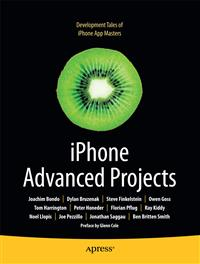

#Apress Source Code

This repository accompanies [*iPhone Advanced Projects*](http://www.apress.com/9781430224037) by David Mark, Dylan Bruzenak, Joachim Bondo, Owen Goss, Peter Honeder, Ray Kiddy, Steve Finkelstein, Tom Harrington, Jonathan Saggau, Noel Llopis, Ben Smith, Joe Pezzillo, Florian Pflug, Dylan  Bruzenak, and Roderick Smith (Apress, 2009).

Download the files as a zip using the green button, or clone the repository to your machine using Git.

##Releases

Release v1.0 corresponds to the code in the published book, without corrections or updates.

##Contributions

See the file Contributing.md for more information on how you can contribute to this repository.
